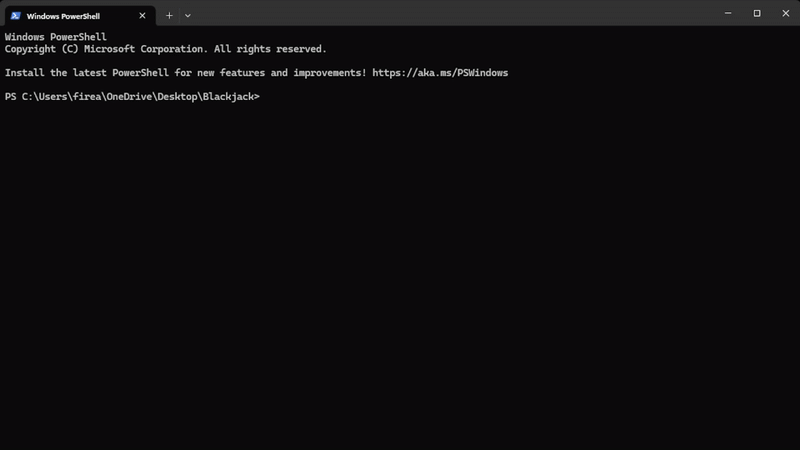

# Blackjack
A simple terminal based Blackjack game made by Ahmed Al-Dailami!

**How To Run**
1. Right click on Blackjack folder 
2. Press open in terminal
3. Run Java Blackjack in terminal
    - `java Blackjack`
4. If java is not installed get it here
    -https://www.oracle.com/java/technologies/javase/jdk21-archive-downloads.html
5. Enjoy!

**SHOWCASE**
- 
